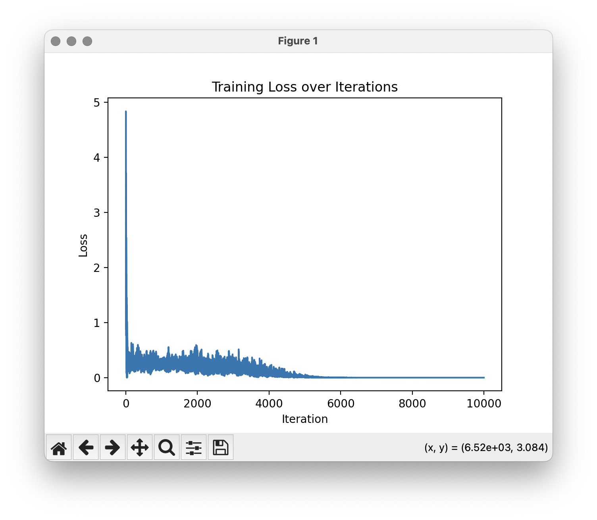
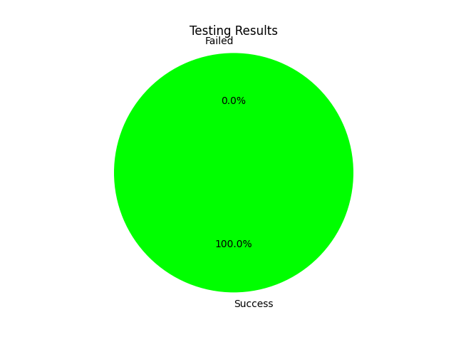

# 💻 MLX Neural Networks

🚀 This repository contains code examples of designing, implementing, and evaluating neural networks. All code examples are from my PoCs, learning and personal experience.

🎓 You can use these code examples for educational or work purposes. I would be grateful for citing materials provided here. Please also cite and credit all materials created by other authors you use for your work.

⚡️ You can subscribe to my Medium account to read articles about artificial intelligence, cloud computing, state-of-the-art technologies, and also audio engineering! Here is a link:

[My Articles on Medium](https://medium.com/@olehch)

🙌 This collection was created by Oleh Chaplia and is constantly updated.

## Table of Contents

1. [MLX Framework](#mxl-framework)
2. [XOR gate neural network](#xor-gate-neural-network)

## MLX Framework

These source code examples contain the usage of [MLX Framework](https://ml-explore.github.io/mlx/build/html/index.html). This framework is designed to build ML apps for Apple Silicon with unified memory architecture, such as M chips.

> MLX is an array framework designed for efficient and flexible machine learning research on Apple silicon.
>
> MLX is an array framework optimized for the unified memory architecture of Apple silicon. The NumPy-like API makes it familiar to use and flexible. The higher level neural net and optimizer packages along with function transformations for automatic differentiation and graph optimization let you build more complex yet efficient machine learning models. MLX also has Swift, C++, and C bindings and can run on any Apple platform.
> 
> [Apple Open Source Project - MLX](https://opensource.apple.com/projects/mlx/)

## Requirements

All python dependencies are defined in the [requirements.txt](./requirements.txt) file.

To install all dependencies run the command:
```
pip install -r requirements.txt
```


## XOR gate neural network

The first example contains source code for a simple neural network that simulates the [XOR gate](https://en.wikipedia.org/wiki/XOR_gate).

This code was inspired by the ["An Introduction to Apple's MLX: Implementing an XOR Gate"](https://www.youtube.com/watch?v=Ol84fDcFvJA) created by [Circuit Chronicles](https://www.youtube.com/@AshraffHathibelagal).

The logic behind the xor gate is described on the Fig.1

| Input 1 | Input 2 | XOR Output |
|---------|---------|------------|
|    0    |    0    |     0      |
|    0    |    1    |     1      |
|    1    |    0    |     1      |
|    1    |    1    |     0      |

Neural network consists of 2 linear layers of 2 neurons. As input, the neural network takes two integer numbers, and outputs one number as a result.

Project files are [here](./1-xor-gate).

The project files contain neural network, test dataset generation, model training, model testing, and model inferencing for a single input. The model is also saved in a *[safetensors](https://huggingface.co/docs/safetensors/index)* format, and a result plots are created.

You can open *[safetensors model file](./1-xor-gate/results/xor_model.safetensors)* using [Netron](https://netron.app).

Test dataset contains 10000 random duplicated combination of the XOR logic. Training results are provided below. After ~6000 iterations the loss is almost zero, therefore provides 100% of correct results for the testing dataset.

 
