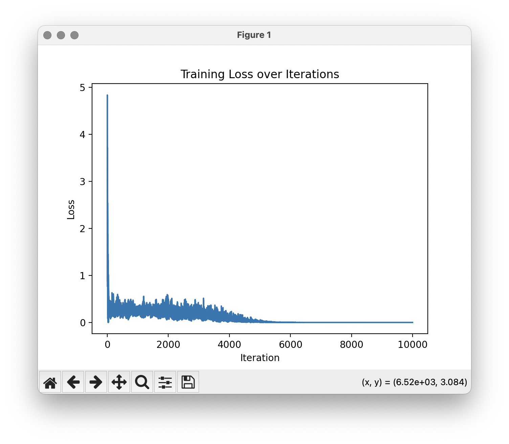
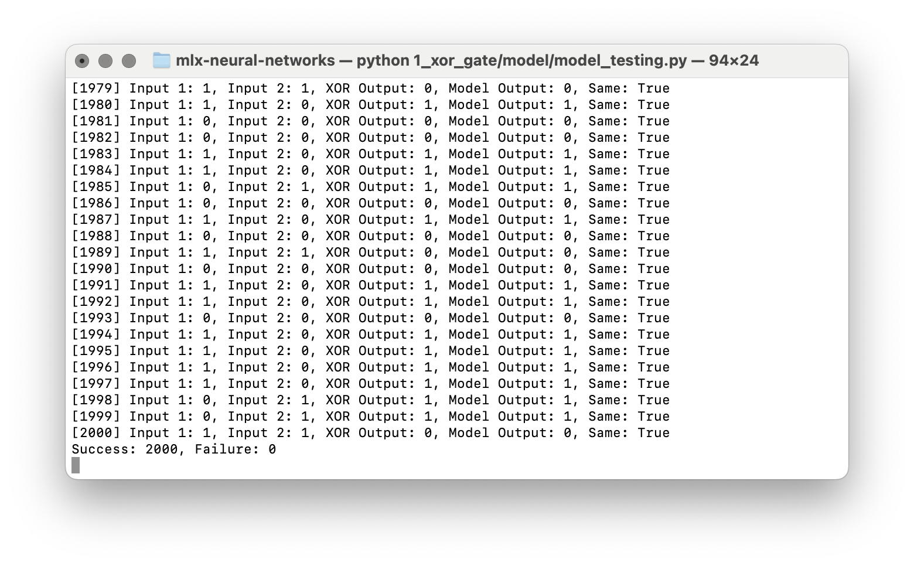
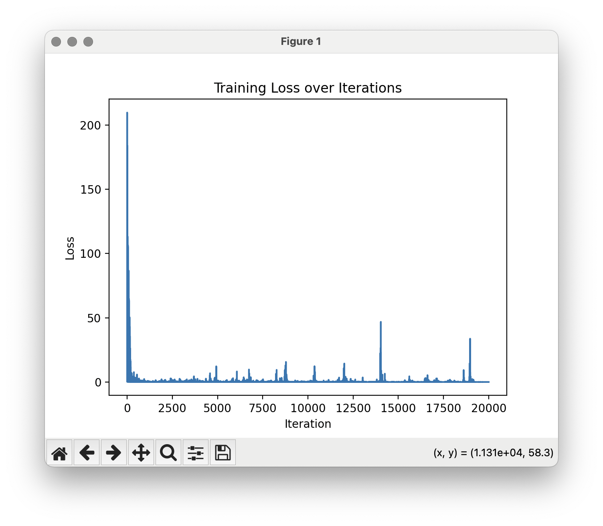
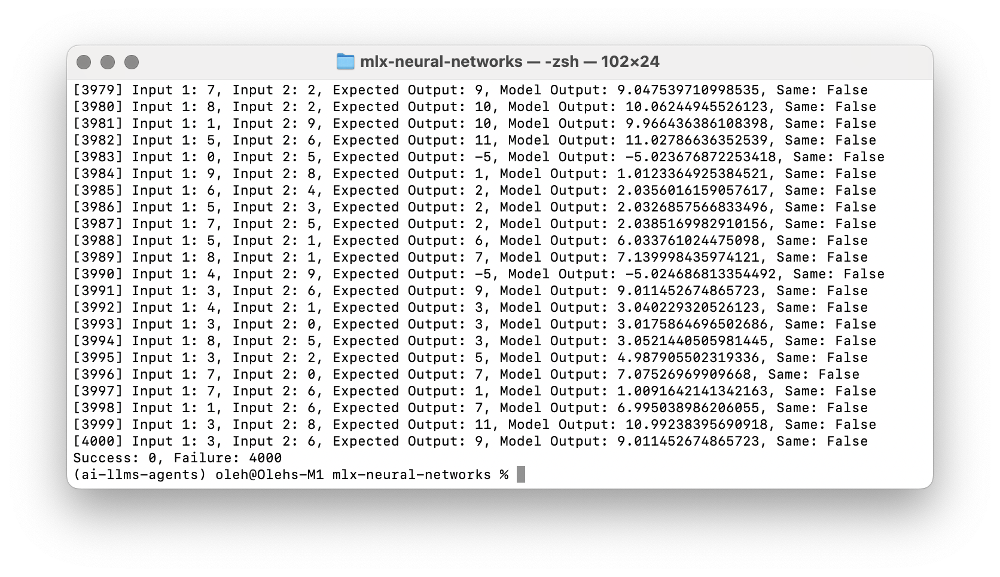
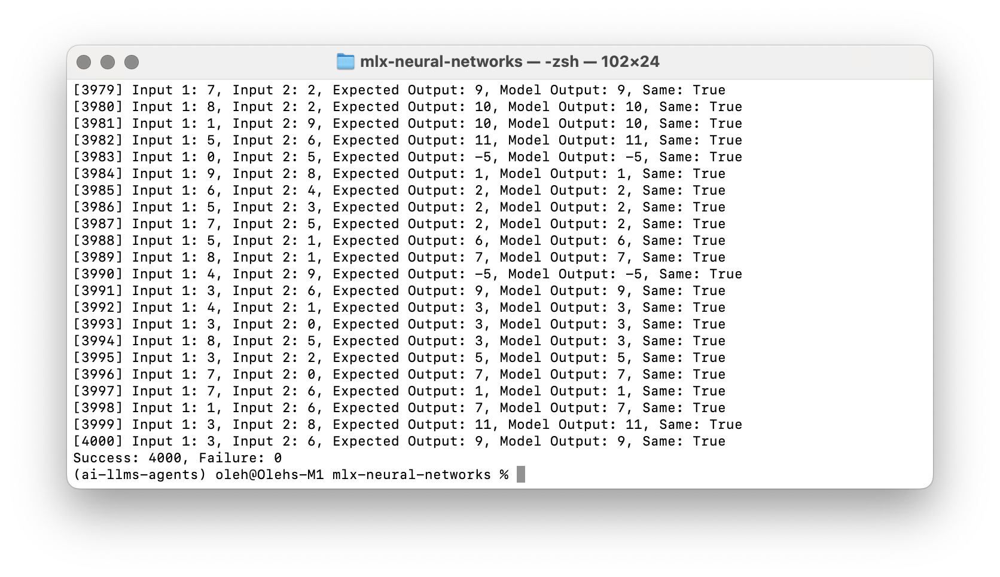

# 💻 MLX Neural Networks

🚀 This repository contains code examples of designing, implementing, and evaluating neural networks. All code examples are from my PoCs, learning, and personal experience.

🎓 You can use these code examples for educational or work purposes. I would be grateful for citing the materials provided here. Please also cite and credit all materials created by other authors you use for your work.

⚡️ You can subscribe to my Medium account to read articles about artificial intelligence, cloud computing, state-of-the-art technologies, and also audio engineering! Here is a link:

[My Articles on Medium](https://medium.com/@olehch)

🙌 This collection was created by Oleh Chaplia and is constantly updated.

## Table of Contents

1. [MLX Framework](#mxl-framework)
2. [Neural network as a XOR gate](#neural-network-as-a-xor-gate)
3. [Neural network as a calculator](#neural-network-as-a-calculator)

## MLX Framework

These source code examples contain the usage of [MLX Framework](https://ml-explore.github.io/mlx/build/html/index.html). This framework is designed to build ML apps for Apple Silicon with unified memory architecture, such as M chips.

> MLX is an array framework designed for efficient and flexible machine learning research on Apple silicon.
>
> MLX is an array framework optimized for the unified memory architecture of Apple silicon. The NumPy-like API makes it familiar to use and flexible. The higher level neural net and optimizer packages along with function transformations for automatic differentiation and graph optimization let you build more complex yet efficient machine learning models. MLX also has Swift, C++, and C bindings and can run on any Apple platform.
> 
> [Apple Open Source Project - MLX](https://opensource.apple.com/projects/mlx/)

## Requirements

All Python dependencies are defined in the [requirements.txt](./requirements.txt) file.

To install all dependencies, run the command:
```
pip install -r requirements.txt
```


## Neural network as a XOR gate

The first example contains source code for a simple neural network that simulates the [XOR gate](https://en.wikipedia.org/wiki/XOR_gate).

This code was inspired by the ["An Introduction to Apple's MLX: Implementing an XOR Gate"](https://www.youtube.com/watch?v=Ol84fDcFvJA) created by [Circuit Chronicles](https://www.youtube.com/@AshraffHathibelagal).

The logic behind the xor gate:

| Input 1 | Input 2 | XOR Output |
|---------|---------|------------|
|    0    |    0    |     0      |
|    0    |    1    |     1      |
|    1    |    0    |     1      |
|    1    |    1    |     0      |

A neural network consists of two linear layers. The input layer consists of two neurons, and the output layer contains one neuron. As input, the neural network takes two integer numbers and outputs one number as a result. Stochastic gradient descent (SGD) optimizer is used.

Project files are [here](./1_xor_gate).

The project files contain neural networks, test dataset generation, model training, model testing, and model inferencing for a single input. The model is also saved in a *[safetensors](https://huggingface.co/docs/safetensors/index)* format, and a result plots are created.

You can open *[safetensors model file](./1_xor_gate/results/xor_model.safetensors)* using [Netron](https://netron.app).

The training dataset contains 10000 random duplicated combinations of the XOR logic. Training results are provided below. After ~6000 iterations, the loss is almost zero, providing 100% of correct results for the validation dataset.

<p align="center">
   
</p>

Project files:
- [Dataset generator](./1_xor_gate/model/dataset.py)
- [Neural Network](./1_xor_gate/model/neural_network.py)
- [Model](./1_xor_gate/model/model.py)
- [Training script](./1_xor_gate/model/model_training.py)
- [Validation script](./1_xor_gate/model/model_testing.py)
- [Inferencing script](./1_xor_gate/model/model_testing.py)

To run the training process:

```bash
python 1_xor_gate/model/model_training.py
```

To run the validation process:

```bash
python 1_xor_gate/model/model_testing.py
```

To run the inferencing:

```bash
python 1_xor_gate/model/model_inferencing.py
```

## Neural network as a calculator

This example contains source code for a simple neural network that works as a calculator for two numbers and supports two operations, "+" and "-."

A neural network consists of 3 linear layers—three neurons for input, ten neurons in a hidden layer, and one neuron for output. As input, the neural network takes two integer numbers, an encoded numerical value that represents "+" (0) or "-" (1), and outputs one number as a result. [Mean squared error loss](https://en.wikipedia.org/wiki/Mean_squared_error) and [Adam optimizer](https://arxiv.org/abs/1412.6980) are used.

Project files are [here](./2_calculator).

The training dataset contains 20000 random duplicated combinations. The dataset includes two numbers, an operation, and an expected result. Training results are provided below. After ~2000 training iterations, the loss is pretty stable. The validation dataset contains 4000 combinations.

The neural network returns the answer very close to the expected result. The difference is very minor. However, when comparing the returned and expected numbers strictly, all results are not the same. Therefore, a math round operation returns the value from the neural network. After rounding the result, the neural network provides 100% of the correct results for the validation dataset.


<p align="center">
  
  
  
</p>

Project files:
- [Dataset generator](./2_calculator/model/dataset.py)
- [Neural Network](./2_calculator/model/neural_network.py)
- [Model](./2_calculator/model/model.py)
- [Training script](./2_calculator/model/model_training.py)
- [Validation script](./2_calculator/model/model_testing.py)
- [Inferencing script](./2_calculator/model/model_testing.py)

To run the training process:

```bash
python 2_calculator/model/model_training.py
```

To run the validation process:

```bash
python 2_calculator/model/model_testing.py
```

To run the inferencing:

```bash
python 2_calculator/model/model_inferencing.py
```
