# 💻 MLX Neural Networks

🚀 This repository contains code examples of designing, implementing, and evaluating neural networks. All code examples are from my PoCs, learning, and personal experience.

🎓 You can use these code examples for educational or work purposes. I would be grateful for citing the materials provided here. Please also cite and credit all materials created by other authors you use for your work.

⚡️ You can subscribe to my Medium account to read articles about artificial intelligence, cloud computing, state-of-the-art technologies, and also audio engineering! Here is a link:

[My Articles on Medium](https://medium.com/@olehch)

🙌 This collection was created by Oleh Chaplia and is constantly updated.

## Table of Contents

1. [MLX Framework](#mxl-framework)
2. [XOR Gate](#xor-gate)
3. [Calculator](#calculator)
4. [MNIST Digit Classification](#mnist-digit-classification)
5. [Cat and Dog Classification](#cat-and-dog-classification)

## MLX Framework

These source code examples contain the usage of [MLX Framework](https://ml-explore.github.io/mlx/build/html/index.html). This framework is designed to build ML apps for Apple Silicon with unified memory architecture, such as M chips.

> MLX is an array framework designed for efficient and flexible machine learning research on Apple silicon.
>
> MLX is an array framework optimized for the unified memory architecture of Apple silicon. The NumPy-like API makes it familiar to use and flexible. The higher level neural net and optimizer packages along with function transformations for automatic differentiation and graph optimization let you build more complex yet efficient machine learning models. MLX also has Swift, C++, and C bindings and can run on any Apple platform.
> 
> [Apple Open Source Project - MLX](https://opensource.apple.com/projects/mlx/)

## Requirements

*UPDATE: `uv` is used for managing dependencies.*

Install [uv](https://docs.astral.sh/uv/getting-started/installation/#installation-methods). All Python dependencies are defined in the [pyptoject.toml](./pyproject.toml) and [requirements.txt](./requirements.txt) files.

To install all dependencies using `uv`, run the command (recommended):

```
uv sync
```

To install all dependencies using `pip`, run the command:
```
pip install -r requirements.txt
```


## XOR Gate

The first example contains source code for a simple neural network that simulates the [XOR gate](https://en.wikipedia.org/wiki/XOR_gate).

This code was inspired by the ["An Introduction to Apple's MLX: Implementing an XOR Gate"](https://www.youtube.com/watch?v=Ol84fDcFvJA) created by [Circuit Chronicles](https://www.youtube.com/@AshraffHathibelagal).

The logic behind the xor gate:

| Input 1 | Input 2 | XOR Output |
|---------|---------|------------|
|    0    |    0    |     0      |
|    0    |    1    |     1      |
|    1    |    0    |     1      |
|    1    |    1    |     0      |

A neural network consists of two linear layers. The input layer consists of two neurons, and the output layer contains one neuron. As input, the neural network takes two integer numbers and outputs one number as a result. Stochastic gradient descent (SGD) optimizer is used.

Project files are [here](./1_xor_gate).

The project files contain neural networks, test dataset generation, model training, model testing, and model inferencing for a single input. The model is also saved in a *[safetensors](https://huggingface.co/docs/safetensors/index)* format, and a result plots are created.

You can open *[safetensors model file](./1_xor_gate/results/xor_model.safetensors)* using [Netron](https://netron.app).

The training dataset contains 10000 random duplicated combinations of the XOR logic. Training results are provided below. After ~6000 iterations, the loss is almost zero, providing 100% of correct results for the validation dataset.

<p align="center">
  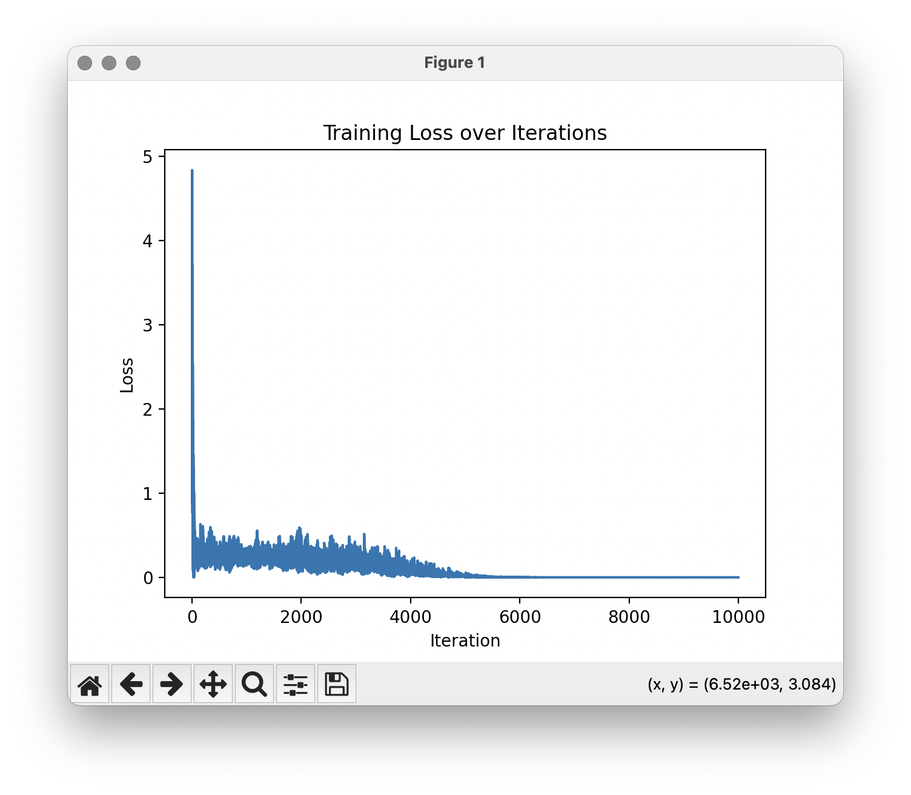 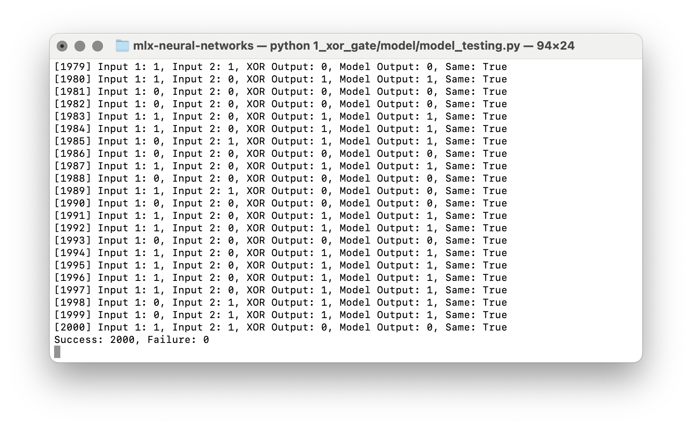
</p>

Project files:
- [Dataset generator](./1_xor_gate/model/dataset.py)
- [Neural Network](./1_xor_gate/model/neural_network.py)
- [Model](./1_xor_gate/model/model.py)
- [Training script](./1_xor_gate/model/model_training.py)
- [Validation script](./1_xor_gate/model/model_testing.py)
- [Inferencing script](./1_xor_gate/model/model_testing.py)

To run the training process:

```bash
uv run ./1_xor_gate/model/model_training.py
```

To run the validation process:

```bash
uv run ./1_xor_gate/model/model_testing.py
```

To run the inferencing:

```bash
uv run ./1_xor_gate/model/model_inferencing.py
```

## Calculator

This example contains source code for a simple neural network that works as a calculator for two numbers and supports two operations, "+" and "-."

A neural network consists of 3 linear layers—three neurons for input, ten neurons in a hidden layer, and one neuron for output. As input, the neural network takes two integer numbers, an encoded numerical value that represents "+" (0) or "-" (1), and outputs one number as a result. [Mean squared error loss](https://en.wikipedia.org/wiki/Mean_squared_error) and [Adam optimizer](https://arxiv.org/abs/1412.6980) are used.

Project files are [here](./2_calculator).

The training dataset contains 20000 random duplicated combinations. The dataset includes two numbers, an operation, and an expected result. Training results are provided below. After ~2000 training iterations, the loss is pretty stable. The validation dataset contains 4000 combinations.

The neural network returns the answer very close to the expected result. The difference is very minor. However, when comparing the returned and expected numbers strictly, all results are not the same. Therefore, a math round operation returns the value from the neural network. After rounding the result, the neural network provides 100% of the correct results for the validation dataset.

<p align="center">
  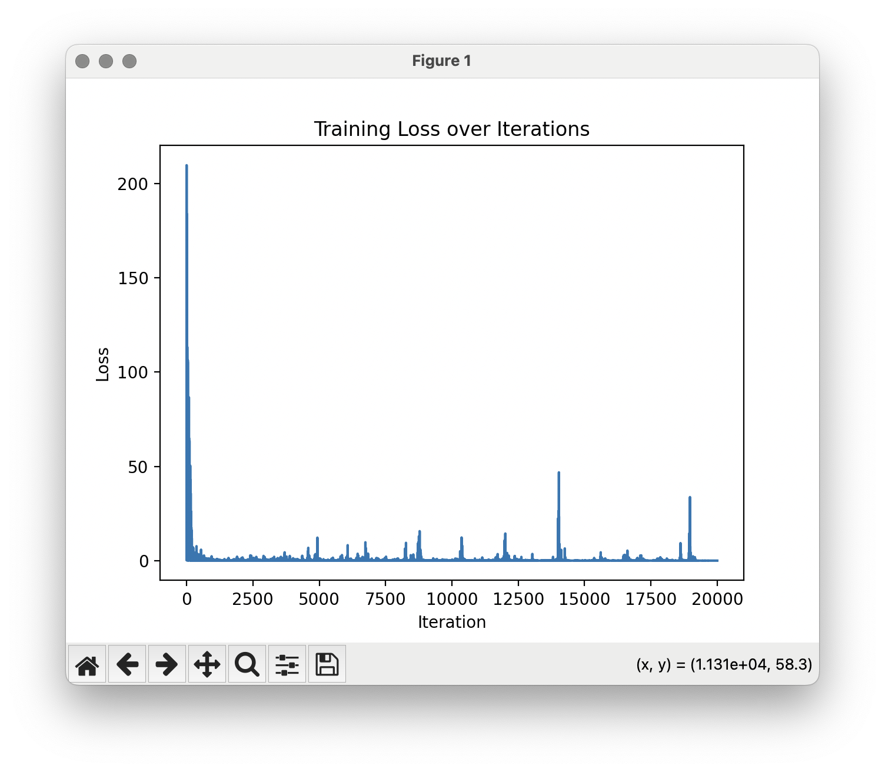
</p>

<p align="center">
  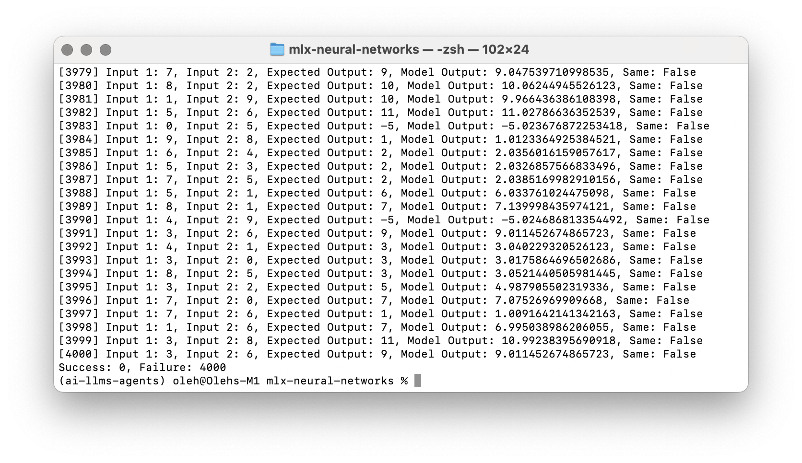
  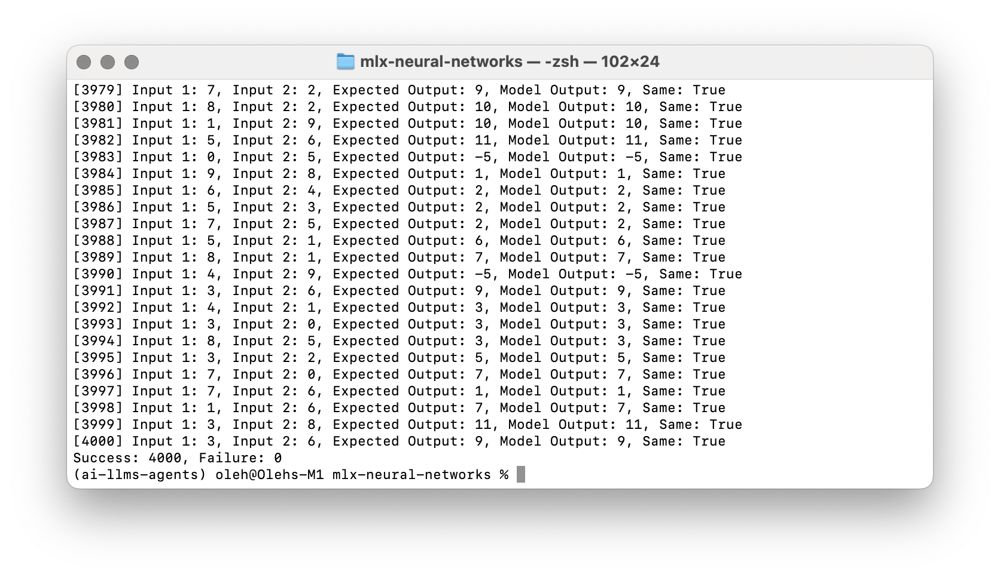
</p>

Project files:
- [Dataset generator](./2_calculator/model/dataset.py)
- [Neural Network](./2_calculator/model/neural_network.py)
- [Model](./2_calculator/model/model.py)
- [Training script](./2_calculator/model/model_training.py)
- [Validation script](./2_calculator/model/model_testing.py)
- [Inferencing script](./2_calculator/model/model_testing.py)

To run the training process:

```bash
uv run ./2_calculator/model/model_training.py
```

To run the validation process:

```bash
uv run ./2_calculator/model/model_testing.py
```

To run the inferencing:

```bash
uv run ./2_calculator/model/model_inferencing.py
```

## MNIST Digit Classification

This example contains source code for a simple MNIST digit classifier. It uses MNIST database of 60000 handwritten digits as images with 28x28 size.

<p align="center">
  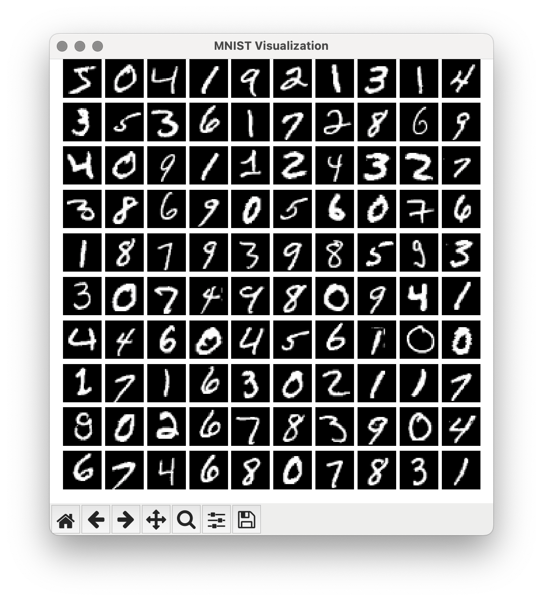
</p>

A neural network consists of 3 linear layers - 784 (28*28) neurons for input, 40 neurons in a hidden layer, and 10 neurons for output. As input, the neural network takes 784 float numbers, that represent the input image. 

[Mean squared error loss](https://en.wikipedia.org/wiki/Mean_squared_error) and [Adam optimizer](https://arxiv.org/abs/1412.6980) are used.

Project files are [here](./3_mnist_classifier/).

The training dataset contains 60000 MNIST handwritten digits. The dataset includes digits and labels. The validation dataset contains 10000 images and labels. Training results are provided below.

<p align="center">
  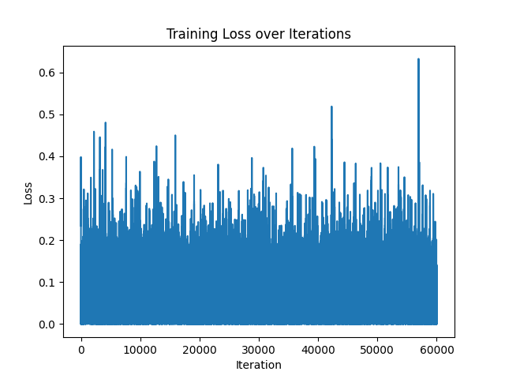
  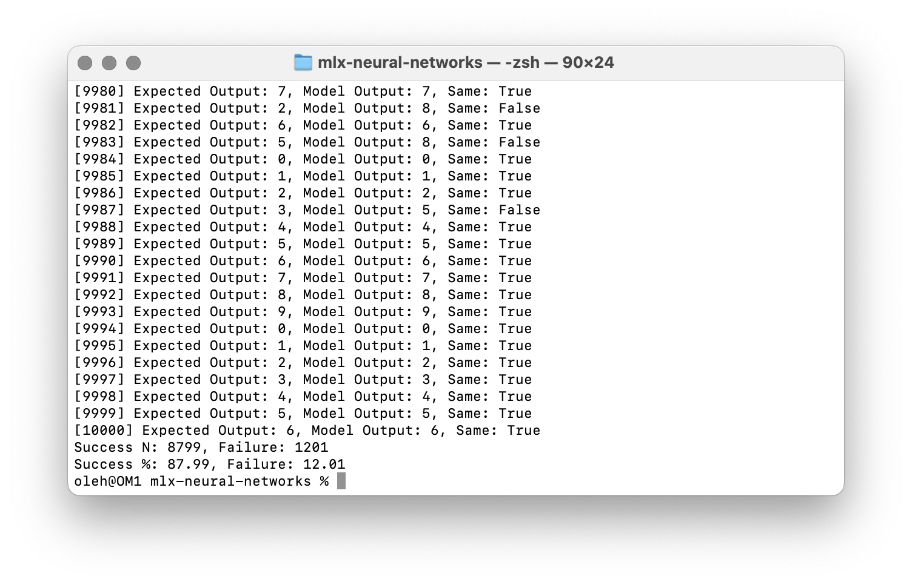
</p>

Project files:
- [Dataset generator](./3_mnist_classification//model/dataset.py)
- [Neural Network](./3_mnist_classification//model/neural_network.py)
- [Model](./3_mnist_classification//model/model.py)
- [Training script](./3_mnist_classification//model/model_training.py)
- [Validation script](./3_mnist_classification//model/model_testing.py)
- [Inferencing script](./3_mnist_classification//model/model_testing.py)

To run the training process:

```bash
uv run ./3_mnist_classification/model/model_training.py
```

To run the validation process:

```bash
uv run ./3_mnist_classification/model/model_testing.py
```

To run the inferencing:

```bash
uv run ./3_mnist_classification/model/model_inferencing.py
```

## Cat and Dog Classification

### Model Description

This example contains source code for a simple cat and dog classification model. A neural network is built using linear layers. The neural network accepts a flattened 64×64 image (4096 pixels) as input, and outputs a single value that represents the probability of the image being a dog (with 0 for cat and 1 for dog). Each image is reduced to 64×64 size grayscale format. 
[Binary cross entropy loss](https://towardsdatascience.com/understanding-binary-cross-entropy-log-loss-a-visual-explanation-a3ac6025181a/) and [Adam optimizer](https://arxiv.org/abs/1412.6980) are used.

### Data Source

Data source - [Cats and Dogs Classification Dataset on Kaggle](https://www.kaggle.com/datasets/bhavikjikadara/dog-and-cat-classification-dataset/data). The training dataset contains a collection of labeled cat and dog images, and the validation dataset is used to evaluate the model’s performance. Dataset is divided into 80% of training data and 20% of validation data.

<p align="center">
  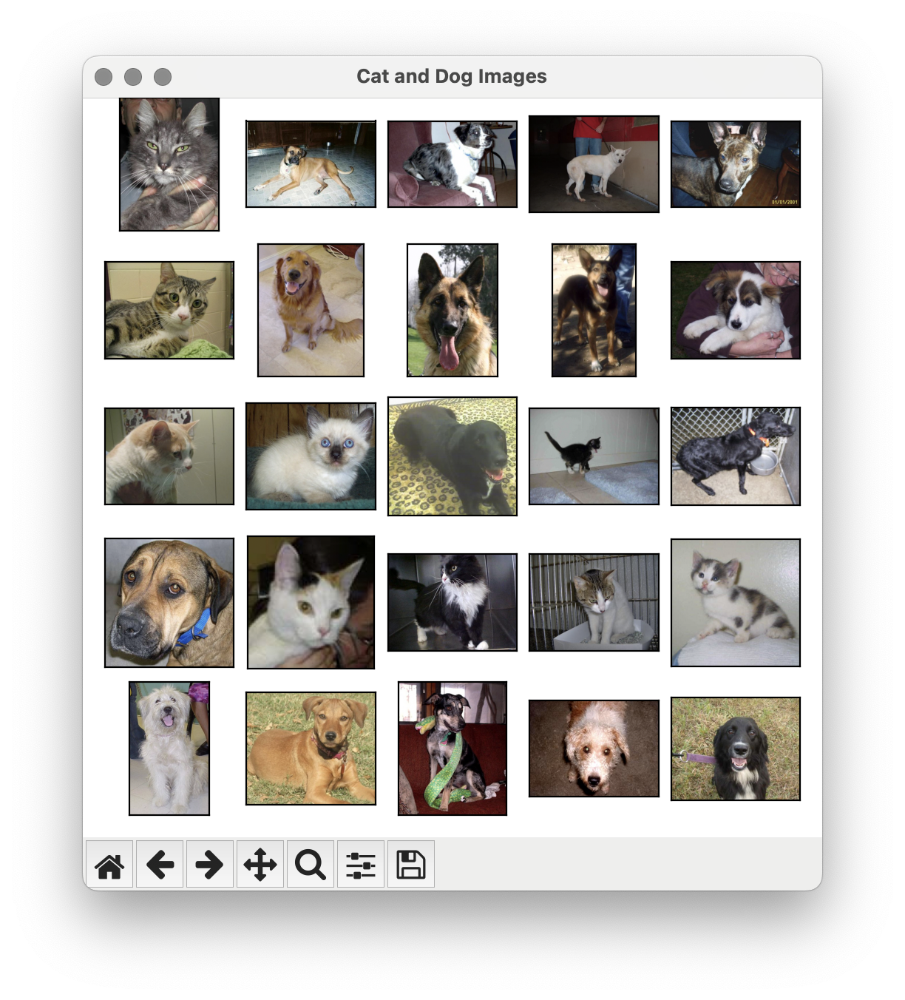
</p>

### Results

The loss, which measures how far the model’s predictions are from the true labels, started high and then dropped quickly at first. However, it soon leveled off at a moderate value. The model achieved an accuracy of around 58%. While this shows that the model can learn from the data, the results are not strong enough for practical use.

<p align="center">
  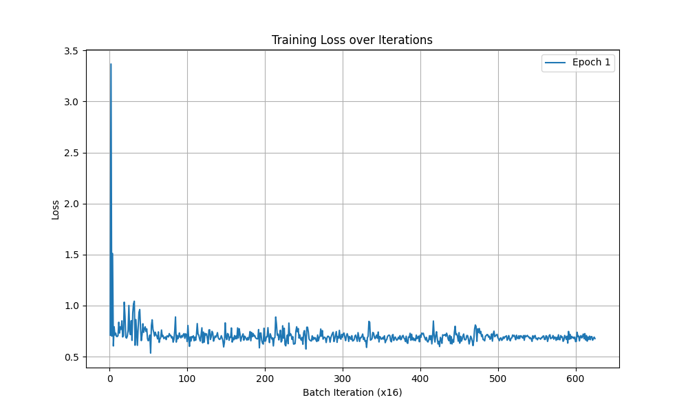
  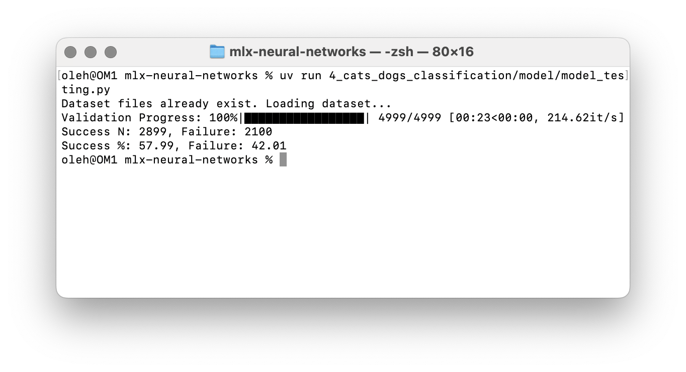
</p>


### Why Accuracy is Low
The low accuracy of ~58% happens because the model is too simple for the task. It only uses a few linear layers, which makes it hard to learn the detailed patterns in images. Flattening a 64×64 image into one long list of numbers loses important information like shapes and edges. Changing the images to grayscale also removes color, which can be useful in telling cats from dogs. In addition, if the training data is small or the settings like learning rate and batch size are not ideal, the model may struggle even more.

### How to Improve the Model
To improve the accuracy Convolutional Neural Network (CNN) can be used instead. CNNs are designed for image data and can keep the spatial details like edges and textures. You can also make the network bigger by adding more layers and using techniques like dropout or batch normalization to help it learn better. Keeping the images in color and using data augmentation methods like flipping or rotating them can add variety to your training data. Finally, adjusting the learning settings and making sure the dataset is balanced will also help boost the accuracy.

### Summary

For educational purposes, this simple cat and dog classifier using linear layers was trained to show that it is possible to build a model from scratch. However, the low accuracy of this basic approach clearly indicates that more advanced models, such as CNNs, are needed for better performance in practical applications.

### Project Files

Project files:
- [Dataset generator](./4_cats_dogs_classification//model/dataset.py)
- [Neural Network](./4_cats_dogs_classification//model/neural_network.py)
- [Model](./4_cats_dogs_classification//model/model.py)
- [Training script](./4_cats_dogs_classification//model/model_training.py)
- [Validation script](./4_cats_dogs_classification//model/model_testing.py)
- [Inferencing script](./4_cats_dogs_classification//model/model_testing.py)

To run the training process:

```bash
uv run ./4_cats_dogs_classification/model/model_training.py
```

To run the validation process:

```bash
uv run ./4_cats_dogs_classification/model/model_testing.py
```

To run the inferencing:

```bash
uv run ./4_cats_dogs_classification/model/model_inferencing.py
```